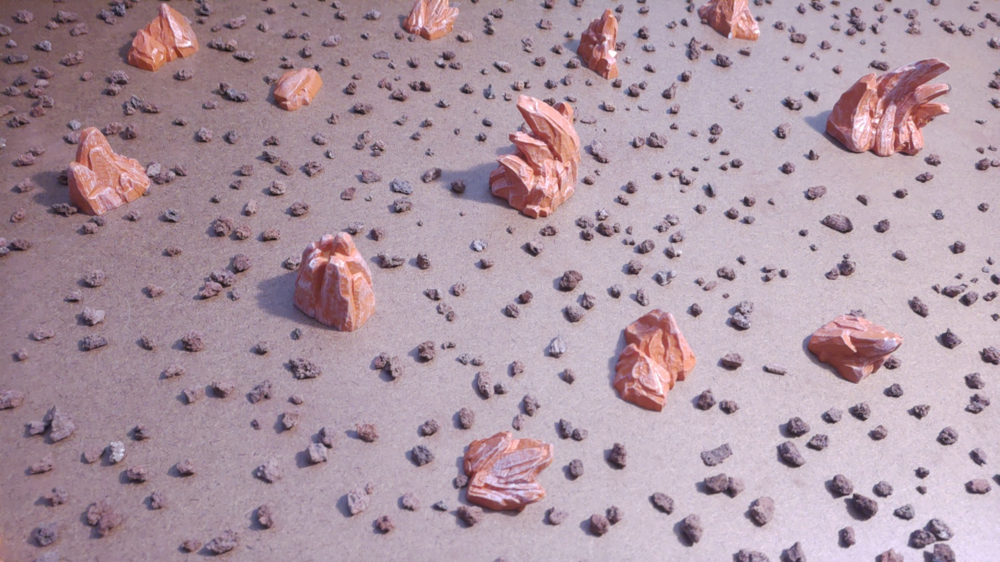
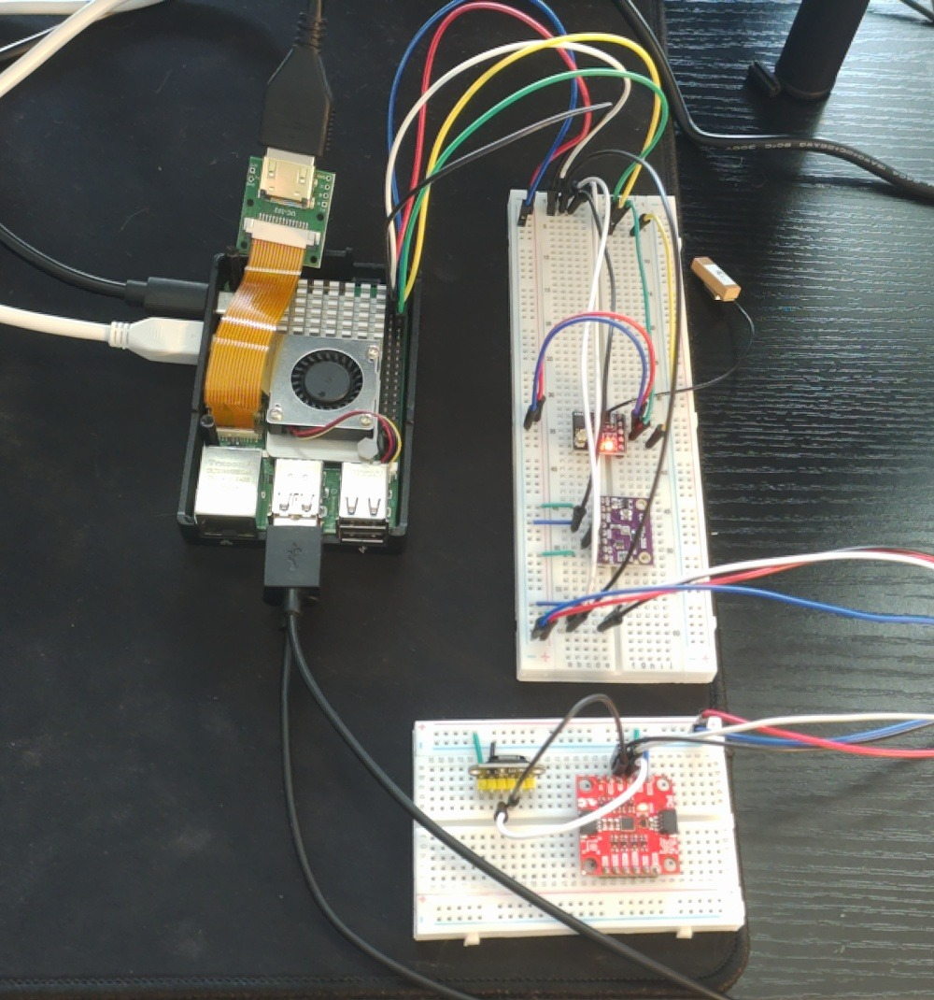
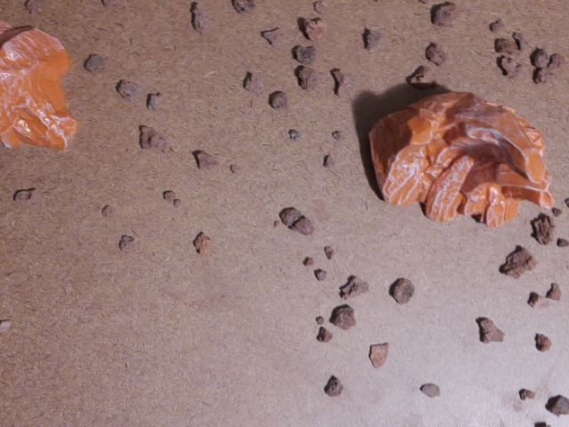
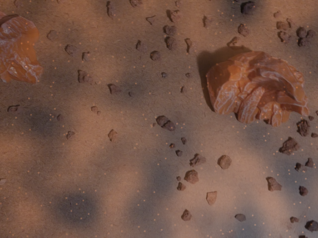
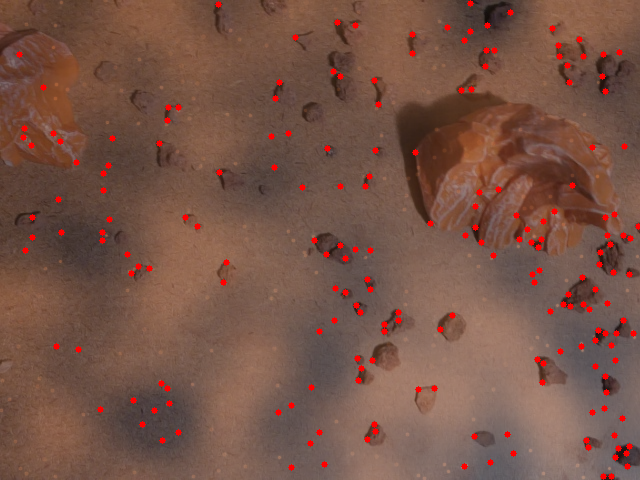
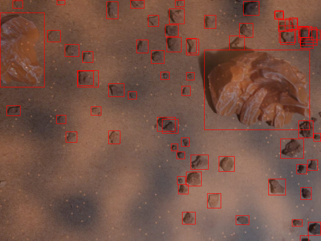

# Martian Helicopter Autonomous Navigation Project

*A Martian helicopter navigating dusty terrain, avoiding hazards, and landing safely.*

## Table of Contents

- [Overview](#overview)
- [Key Achievements](#key-achievements)
- [Mission Architecture](#mission-architecture)
- [Hardware](#hardware)
- [Software](#software)
- [Results](#results)
- [Future Work](#future-work)

## Overview

This project simulates an autonomous Martian helicopter (inspired by NASA's Ingenuity) capable of navigating harsh, dusty environments, detecting and avoiding hazards like rocks, and executing safe landings. Built using Python, OpenCV, and AI models, it fuses data from cameras, IMU, LiDAR, and optical flow for robust state estimation and decision-making. It runs on Raspberry Pi hardware with simulated Martian dust effects for realism.

**Demo Video**

## Key Achievements

- Achieved reliable hazard avoidance in dusty conditions using AI
- Fused multiple sensors for accurate positioning without GPS
- Simulated complete missions from takeoff to safe landing

- **Multi-sensor Fusion** — Extended Kalman Filter combining optical flow, IMU & LiDAR
- **Martian Dust Simulation** — Correlated noise + particle overlay with realistic drift
- **AI Hazard Detection** — YOLOv8 model trained on custom Mars rock dataset  
  → Dramatically more robust against dust particles than traditional corner detection
- **Intelligent Safe Zone Selection** — Distance transform + weighted proximity/clearance scoring
- **Stable Mission State Machine** — Hysteresis prevents mode-chattering
- **Beautiful Real-time Visualization** — Trails, safety heatmaps, navigation arrows & status

## Mission Architecture

The helicopter's mission simulates a Martian exploration scenario:

1. **Ascent**: Take off and reach cruising altitude
2. **Navigation**: Fly toward a predefined search zone while maintaining position via optical flow and IMU
3. **Hazard Detection and Avoidance**: In the search zone, use AI to identify rocks/hazards and select a safe landing spot
4. **Landing Approach and Descent**: Lock onto a safe site, hover for confirmation, and land precisely
5. **Fallback Modes**: Handle no-safe-zone scenarios by alerting or retreating

**Success metrics:**
- Navigate 10–15 cm routes with <2 cm landing accuracy
- Avoid hazards in 95% of dusty test runs
- Real-time performance at 30 FPS on Raspberry Pi

This mirrors real Mars challenges like low gravity, thin atmosphere, and dust storms.

## Hardware

The system runs on a Raspberry Pi 4 with attached sensors to mimic a helicopter's payload.

**Components:**
- **Raspberry Pi 4** — Core processing unit
- **Pi Camera Module** — For optical flow and visual input (downward-facing)
- **IMU (ICM-20948)** — Acceleration and gyro data for orientation
- **LiDAR (VL53L1X)** — Precise altitude measurement
- **Custom Frame** — Mounted on a test rig for safe indoor testing

> Note: No actual flight hardware is used — motion is simulated via manual movement or a robot base for demos.

## Software

The codebase is modular and follows clean separation of concerns:

autonomous_nav/
├── app.py                # Main application loop
├── config.py             # Centralized configuration (dataclasses)
├── camera.py             # PiCamera handling & countdown
├── imu.py                # IMU driver & calibration
├── lidar.py              # LiDAR driver
├── preprocessor.py       # Image enhancement pipeline (CLAHE, blur)
├── feature_detector.py   # Shi-Tomasi corner detection
├── optical_flow.py       # Lucas-Kanade optical flow
├── state_estimator.py    # Extended Kalman Filter sensor fusion
├── hazard_avoidance.py   # Hazard detection (AI + classical)
├── dust.py               # Realistic Martian dust simulation
├── mission_manager.py    # Mission state machine
├── visualizer.py         # Real-time UI overlays & annotations
└── utils.py              # Helper functions (pixel ↔ cm conversions, etc.)

## Results

**Chalenges and Solutions:**

| Challenge                               | Solution                                                                                   |
|-----------------------------------------|--------------------------------------------------------------------------------------------|
| Dust particles fool corner detectors    | Switched to semantic AI (YOLO) for hazard detection; dust simulator for rigorous testing |
| Accumulating drift in visual odometry   | Sensor fusion with IMU & LiDAR; proper bias calibration & quaternion handling             |
| Real-time performance on Raspberry Pi   | Optimized YOLO inference (320×320), lightweight preprocessing, median flow               |
| Unstable landing mode transitions       | Added hysteresis (consecutive frame confirmation) & median filtering of landing points   |
| Initial orientation/tilt errors         | Gravity-based automatic initial quaternion alignment during IMU calibration              |

| Clean Image                  | With Dust Simulation              |
|------------------------------|-----------------------------------|
|    |         |
| **Dust + Shi-Tomasi Corners** | **Dust + YOLO Rock Detection**    |
|  |          |

This design makes it easy to swap components (e.g. classical vs. AI hazard detection).

Video 1: Complete Mission
Full Mission
Navigation → hazard avoidance → safe autonomous landing in dusty conditions
Video 2: Dust Robustness Comparison
Dust Comparison
Traditional corner detection vs. AI-based approach under heavy dust
Test Statistics (50 runs):

Safe landing success rate: 92%
Average final position error: < 1.5 cm

Safe zone heatmap example
Future Work

Real drone flight integration (DroneKit / PX4)
Visual SLAM for unknown terrain mapping
Multi-robot coordination
Outdoor Mars-analog field testing

## Future Work